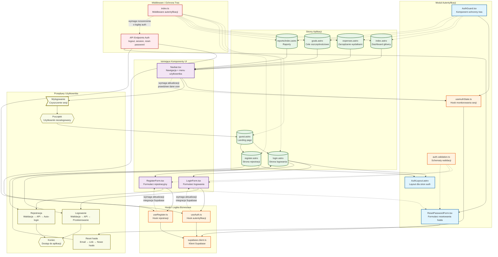

# Diagram Architektury UI - System Autentyfikacji HouseFlow

## Opis Diagramu

### Architektura Poziomów
Diagram przedstawia wielopoziomową architekturę systemu autentyfikacji HouseFlow:

1. **Warstwa UI** - Komponenty React i strony Astro
2. **Warstwa Logiki Biznesowej** - Hooki i serwisy autentyfikacyjne  
3. **Warstwa Infrastruktury** - Supabase, middleware, API
4. **Warstwa Przepływów** - Scenariusze użycia systemu

### Kluczowe Zależności
- **AuthGuard** chroni wszystkie strony wymagające autentyfikacji
- **Middleware** sprawdza stan sesji dla każdej strony
- **Hooki** dostarczają stan autentyfikacji wszystkim komponentom
- **Supabase Client** jest centralnym punktem integracji z backendem

### Komponenty Wymagające Aktualizacji
Diagram wyróżnia komponenty oznaczone jako "wymaga aktualizacji", które muszą zostać zmodyfikowane zgodnie ze specyfikacją:
- `useAuth.ts` - integracja z Supabase Auth SDK
- `useRegister.ts` - integracja z Supabase Auth SDK  
- `Navbar.tsx` - prawdziwe dane użytkownika zamiast mocków
- `middleware/index.ts` - logika sprawdzania sesji

### Nowe Komponenty do Utworzenia
- `AuthGuard.tsx` - ochrona tras aplikacji
- `AuthLayout.astro` - spójny layout dla stron autentyfikacyjnych
- `ResetPasswordForm.tsx` - obsługa resetowania hasła
- `useAuthState.ts` - monitorowanie stanu sesji w czasie rzeczywistym
- `auth.validation.ts` - współdzielone schematy walidacji

### Przepływy Użytkownika
Diagram ilustruje główne scenariusze użycia:
- **Logowanie**: guest → login → dashboard
- **Rejestracja**: guest → register → dashboard  
- **Reset hasła**: login → reset form → login
- **Wylogowanie**: dowolna strona → logout → guest

Taka architektura zapewnia bezpieczeństwo, spójność UX i łatwość utrzymania systemu autentyfikacji.
